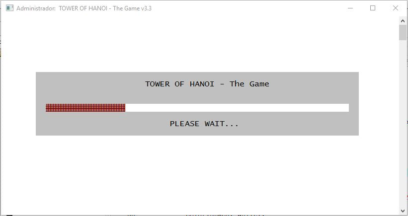
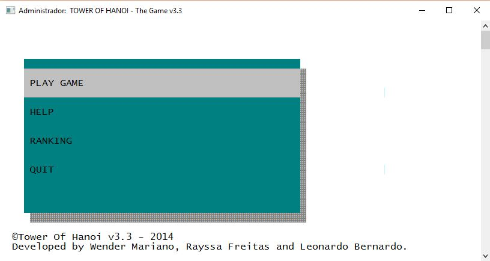
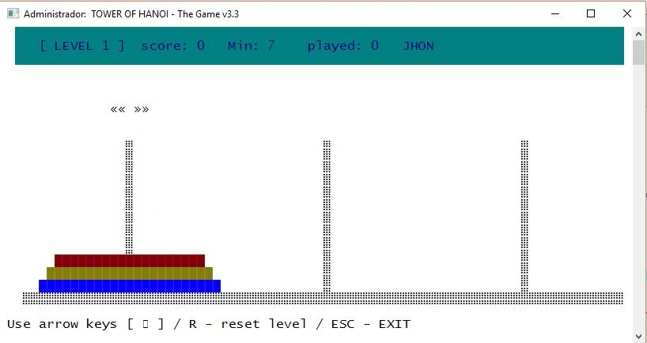
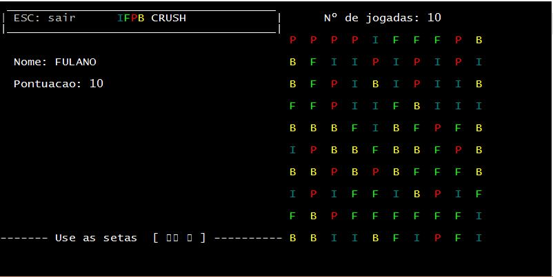

# HanoiTower

Game developed in the programming language C.
Project structure: Console Application [Dev-c++](https://sourceforge.net/projects/orwelldevcpp/)

# IFPB-CRUSH
Game developed in the programming language C. It is based on the [Candy Crush](https://pt.wikipedia.org/wiki/Candy_Crush_Saga).
Project structure: Console Application [Dev-c++](https://sourceforge.net/projects/orwelldevcpp/)

